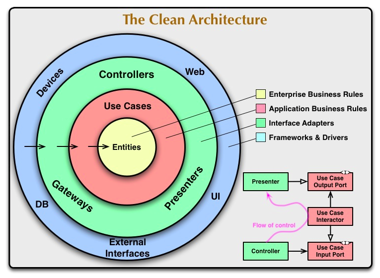
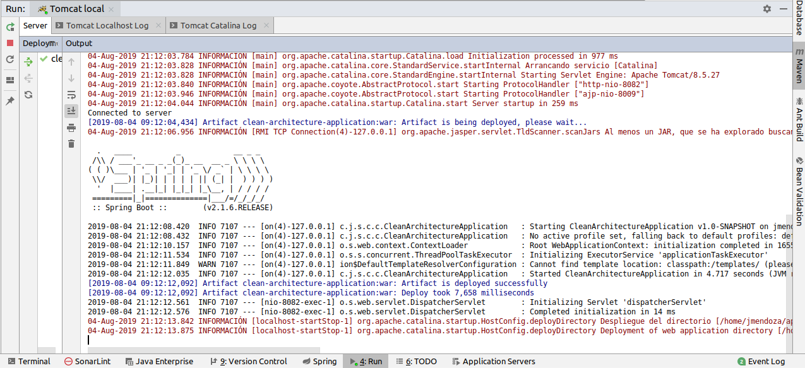
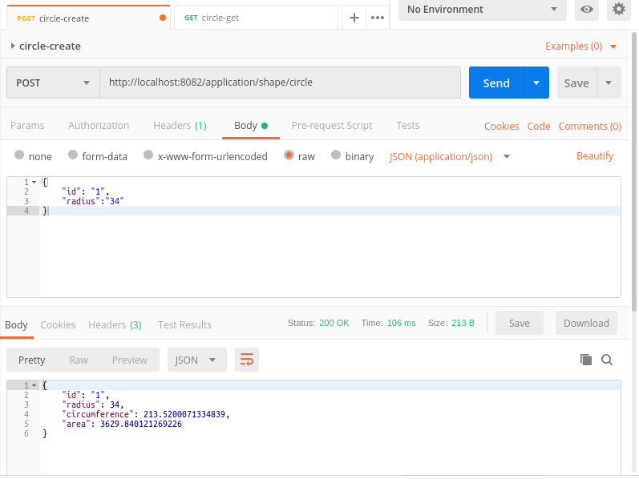
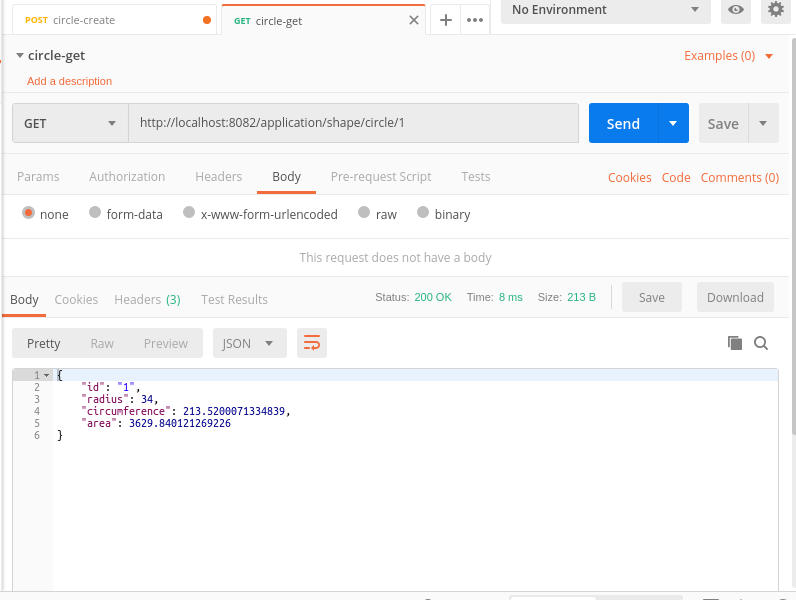

# Example Clean Architecture with Spring Boot

### Domain: 
"These are the business objects of your application. These should not be affected by any change external to them, and these should be the most stable code within your application. These can be POJOs, objects with methods, or even data structures."

### Use Cases: 
"Implement and encapsulate all of the business rules."

### Interface Adapters: 
"Convert and present data to the use case and entity layers."

### Frameworks and Drivers: 
"Contain any frameworks or tools you need to run your application."

### IntelliJ IDEA - Maven

### IntelliJ IDEA - Spring Boot

### Postman - Create

### Postman - Get

